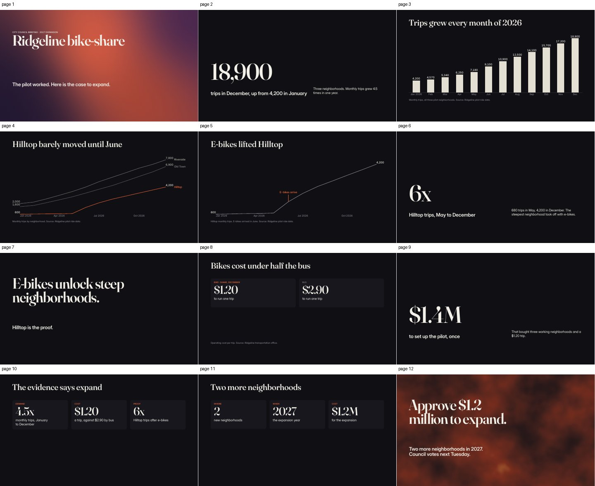
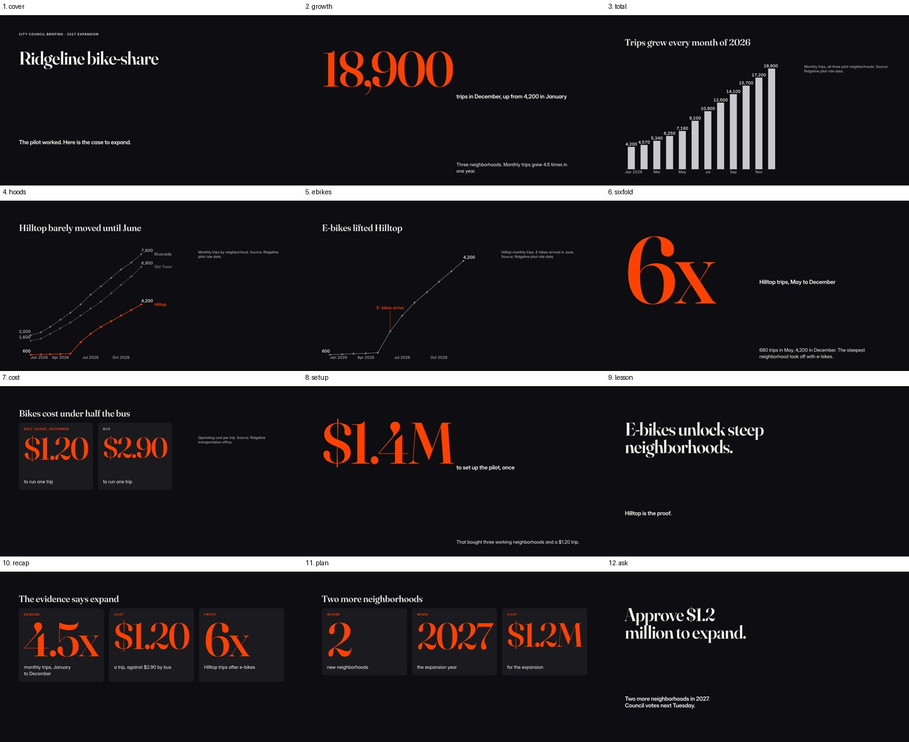

# An agent makes a deck with MCP alone (gate 1)

Gate 1's first criterion asks for this run. From Claude Code, using only MCP, an agent makes a 12-state deck from a CSV and a one-paragraph brief. It lints the deck to zero errors, renders every state, and exports a PDF and a 1080p60 video. The second criterion asks it to re-theme the deck with `theme_apply` and to explain the lint delta. The fifth asks for a narrative lint finding on the authorability deck that is a true positive, repaired by an agent. This file records all three, and what the runs found in Scaena on the way.

**Verdict: criteria 1, 2, and 5 are met.**

- **Criteria 1 and 2.** In attempt 3, an agent with nothing but the scaena MCP server made the deck in 8.7 minutes and 80 turns. It linted the deck to zero errors, rendered every state, and exported a 12-page PDF and an 87-second 1080p60 video with a chapter per beat. It then re-themed the deck to Ember and took the 14 errors that added back to none.
- **Criterion 5.** A fresh agent repaired a true W423 on the authorability deck.
- **Fixes.** Attempts 1 and 2 found eight problems in Scaena, each fixed in #53–#58.
- **Open.** The runs found more than those eight. They are under Findings, with what became of each.

## Method

- **The client.** Claude Code 2.1.288, headless (`claude -p`), with one MCP server: `scaena mcp`.
  - `--strict-mcp-config --mcp-config mcp.json` gives it that server and no other.
  - `--tools "ListMcpResourcesTool,ReadMcpResourceTool"` leaves it no built-in tools but the two that read MCP resources: no shell, no file reads or writes, no web.
  - `--allowedTools mcp__scaena` lets it call the server's 12 tools without asking.
- **The server.** Attempt 3 ran a release build of main at f348af6 with #55–#58 applied, the fixes then in review.
- **What it knew.** The prompt below, and what the server serves:
  - the tools' descriptions and schemas;
  - the format's schemas, the lint catalog, and SPEC;
  - the skills and the example decks and themes.

  It could not read the code, the docs folder, or any file on disk, the CSV included, except through the tools.
- **Judging.** I read the transcript and lint the bundle it left. I also render every state, read the PDF with `pdfinfo` and `pdftotext`, and probe the video with `ffprobe` and by its frames.

The prompt, verbatim, with the run's scratch directory written `<run>`:

> You are making a presentation with Scaena, a presentation engine. Your only tools are the scaena MCP server's tools and its resources (`scaena://...`): the format's schemas, the SPEC, the lint catalog, example decks, and skills for authoring. Read what you need from them; you have nothing else.
>
> The brief, from the city's transportation office:
>
> > Ridgeline's bike-share pilot ran in three neighborhoods through 2026, and <run>/ridgeline-rides.csv has its monthly trips by neighborhood. Trips grew from 4,200 in January to 18,900 in December. Hilltop, the steepest neighborhood, barely moved until e-bikes arrived in June, then grew sixfold by December. The pilot cost $1.4 million to set up, and by December a trip cost about $1.20 to run, against $2.90 for the bus. Next Tuesday the city council votes on expanding to two more neighborhoods in 2027 for $1.2 million. Build the deck for that meeting: make the case, and end on the ask.
>
> Please:
> 1. Make a bundle at <run>/ridgeline (a new directory) from the theme docs/examples/themes/dusk.theme.json, with the CSV attached.
> 2. Write a 12-state deck for the meeting: a spine of beats with their claims, charts from the data, one state per click.
> 3. Lint it until it has no errors, and look at every state by rendering it. Fix what looks wrong, not only what lint finds.
> 4. Export a PDF to <run>/out/ridgeline.pdf and a 1080p video at 60 frames a second to <run>/out/ridgeline.mp4.
> 5. Then re-theme the deck with docs/examples/themes/ember.theme.json, using theme_apply. Lint and look again, and fix or explain whatever the new theme changes.
>
> As you go, note what you did, and anything in the tools or the docs that was unclear or got in your way. End with a short report: the beats, the states, the lint before and after the re-theme, the exports, and those notes.

The CSV is `docs/examples/data/ridgeline-rides.csv`: monthly trips for three neighborhoods, January to December 2026. Its totals run from 4,200 to 18,900. The first two attempts' brief said "by December a trip cost about $1.20". The second agent pointed out that this cannot be $1.4 million over the year's trips, so the third's says "to run".

## Three attempts

The first two runs found eight problems in Scaena. The third ran with all eight fixed.

### Attempt 1: the resources would not load

Claude Code opens with `server/discover` and names protocol 2026-07-28 in every request's `_meta`. That protocol makes a list or read result without `ttlMs` and `cacheScope` invalid (SEP-2549). The server, on rmcp 3.5, set neither, so every `ReadMcpResourceTool` failed:

```
Invalid result for resources/read: [ { "expected": "number", "path": ["ttlMs"], … },
  { "values": ["public", "private"], "path": ["cacheScope"], … } ]
```

`ListMcpResourcesTool` said "No resources found", and I stopped the run. Logging the handshake turned up two more problems:

- **History.** The server recorded its client's name in `initialize`, which discovery never sends, so an agent's edits went into a bundle's history as plain `agent`.
- **Schemas.** The tool schemas carried number formats (`uint32`, `double`) that the client's validator warned about, 24 times a session.

#53 fixes all three (SPEC §7.2).

### Attempt 2: the video timed out, and the retry broke it

With the resources readable, the agent built the deck in 6.9 minutes over 73 turns. It linted the deck to zero errors under Dusk, exported the PDF, re-themed to Ember, and linted to zero again. The video failed:

- **Claude Code gives a tool call 60 seconds.** A 1080p60 video of this deck takes about 70 seconds on this container, so `deck_export` timed out. Progress notifications do not extend the limit: a probe server sent eleven over 75 seconds, and the call was still cut off at 60 with `notifications/cancelled`.
- **The export did not stop when the call did.** The agent retried, which started a second export of the same file. Both ffmpeg processes wrote `ridgeline.mp4.partial`, and the file that remained had no streams.

#54 keeps a long export going past the call:

- The call answers within 40 seconds with `running` and how far the export has got.
- The same call again waits for the rest.
- Another export of a file still being written is refused.
- Each export writes a partial file of its own.

Four more findings came from attempt 2's notes and renders, and from the files it left:

- **Re-theming meant guessing names.** After `theme_apply` to Ember, lint found nine E102s: a layout, slots, and a shader preset that Ember does not have. Nothing listed what Ember has, and the agent could not read the theme file. So it guessed names in dry-run patches until lint stopped objecting. #55 makes each E102 for a theme name list the names of that kind the theme has.
- **A chart cut off its series names, and lint said nothing.**
  - Under Ember, "Riverside" and "Old Town" ran 7 cu past the line chart's side.
  - The room beside the plot assumed a name starts `lead` past the line's last point, but the names were drawn `lead` past the point's dot.
  - The agent saw it in the render and moved the names to a legend.
  - #56 places the names where the room assumes. It also makes E100 report chart text cut off at the chart's side.
- **Dates printed as ISO and ran together.** A stacked bar of months printed 2026-01-01 to 2026-12-01 under its bars, each label wider than its band. #57 prints dates on a category axis by their unit (Jan 2026, Feb, …, Dec) and keeps every k-th label where they crowd.
- **The PDF was 31 MB.** Its two mesh backdrops were lossless images at twice the canvas, 14.7 MB each. #58 writes an opaque shader as JPEG at quality 90, about 1 MB, and keeps a translucent one whole.

### Attempt 3: met

The agent took 80 turns and 8.7 minutes: 79 tool calls, among them 9 resource reads, 17 patches, 6 lints, and 32 renders.

1. **Reading** (calls 1–8). It read the author-deck, chart-from-data, retheme, and motion-pass skills, the trails example, Dusk's theme, and the lint catalog.
2. **Making the bundle and reading the data** (9–18).
   - `deck_create` made the bundle on Dusk with the CSV attached.
   - It checked the brief's figures in a throwaway line chart: 4,200 in January, 18,900 in December, and Hilltop 680 in May to 4,200 in December, so "sixfold" holds from May.
   - A probe table was refused (E103: its first column repeats, and a table keys each row by it).
   - The deck schema (74 KB) and SPEC (157 KB) came back as files the agent had no tool to open. It learned `aggregate`'s syntax from the E106 that a dry run returned.
3. **Writing and checking** (19–42).
   - It wrote the deck in two patches, of 3 and 12 ops.
   - Lint found one error, a title too long for its box, which it shortened.
   - It rendered all 12 states, re-placed the card grids it judged too tall, and linted to zero.
4. **Exporting** (43–49).
   - The PDF came back at once: 12 pages, 1.6 MB.
   - The video answered `running` five times (376, 3,448, 4,896, 5,024, and 5,144 of 5,219 frames), then returned it on the sixth call, about 4 minutes in. In attempt 2 the export took about 70 seconds. Here the container's four cores were also building Scaena: I ran a `just check` in that window.
5. **Re-theming** (50–79): below, under criterion 2.

Judged afterwards:

| | |
|---|---|
| Lint | 0 findings, on Ember as the agent left it |
| PDF | 12 pages of 960 × 540 pt, tagged, titled "Ridgeline bike-share: expand in 2027", 1.6 MB; the text copies as the slides read |
| Video | H.264, 1920 × 1080 at 60 fps, 5,219 frames, 87.0 s, 6.8 MB, 10 chapters; frames at 3, 25, 47, and 84 s show the cover, the Hilltop chart, the cost cards, and the ask |

The video's chapters are the beats' claims:

```
 0.0 s  The Ridgeline pilot worked, and the case to expand is strong.
 5.8 s  Monthly trips grew from 4,200 in January to 18,900 in December.
20.2 s  Hilltop, the steepest neighborhood, barely moved until June.
28.2 s  E-bikes arrived in June, and Hilltop trips grew sixfold by December.
42.9 s  By December a bike trip cost about $1.20 to run, against $2.90 for the bus.
51.2 s  The $1.4 million set-up cost bought a system that now runs cheaply.
57.7 s  E-bikes unlock steep neighborhoods.
63.2 s  Demand, cost, and proof all point to expanding.
71.8 s  The proposal is two more neighborhoods in 2027.
80.0 s  Approve $1.2 million to expand to two more neighborhoods in 2027.
```

## The deck

The spine is 5 sections of 10 beats over 12 states, one state per click:

| Section | Beat | Claim | States |
|---|---|---|---|
| opening | open | The Ridgeline pilot worked, and the case to expand is strong. | `cover` |
| growth | growth | Monthly trips grew from 4,200 in January to 18,900 in December. | `growth`, `total` |
| | hilltop-stalled | Hilltop, the steepest neighborhood, barely moved until June. | `hoods` |
| hilltop | ebikes | E-bikes arrived in June, and Hilltop trips grew sixfold by December. | `ebikes`, `sixfold` |
| | lesson | E-bikes unlock steep neighborhoods. | `lesson` |
| cost | cheaper | By December a bike trip cost about $1.20 to run, against $2.90 for the bus. | `cost` |
| | setup | The $1.4 million set-up cost bought a system that now runs cheaply. | `setup` |
| ask | recap | Demand, cost, and proof all point to expanding. | `recap` |
| | proposal | The proposal is two more neighborhoods in 2027. | `plan` |
| | ask | Approve $1.2 million to expand to two more neighborhoods in 2027. | `ask` |

- **The charts read the CSV directly.**
  - `total` is a bar of monthly trips, which a `dataTransform` sums from the rows by month.
  - `hoods` draws a line per neighborhood, with Hilltop in the accent.
  - `ebikes` is the same chart node filtered to Hilltop, with an "E-bikes arrive" callout at June, so the marks move from one state to the next.
- **The rest.** Three stat slides (18,900, 6x, $1.4M), the cost in two cards ($1.20 against $2.90), a statement, a recap and a plan in cards, and the ask.
- **Backdrops.** Under Dusk the cover has a mesh and the ask has noise.

The spine and the states disagree in one place. The spine puts `lesson` before the cost beats, and the states put it after them. The PDF reads in spine order and the video in state order, so they tell the story in different orders (Findings). Lint now reports it as W426 (PLAN 1.36).

Under Dusk, from the PDF:



Under Ember, as the agent left it:



## Re-theme (criterion 2)

The dry run, then `theme_apply` to Ember, added 14 errors and removed none. Each is a name Dusk has and Ember does not:

| Errors | What the deck names | What Ember has (from the E102s) |
|---|---|---|
| 2 E102 | shader presets `mesh-soft`, `noise-fine` (the cover's and the ask's backdrops) | none |
| 6 E102 | layout `figure`, in six states | title, statement, poster, full, chart, narrow-chart, stat, art-left, art-right |
| 6 E102 | slots `meaning` and `aside` in layout `stat`, on three stat slides | kicker, number, claim, detail, under, canvas, grid |

The agent fixed them from those lists:

1. **Layouts and slots.** It moved the six states to `chart`, and the stat slots to `claim` and `detail`.
   - Its first patch also kept the chart states' slots `main` and `footer`. The patch was refused, with E102s naming `chart`'s slots (kicker, header, chart, side, canvas, grid).
   - The next patch used `chart` and `side` and was applied.
2. **Shaders.** It removed the two backdrops, since Ember has no shader presets. The cover and the ask are plain dark under Ember.
3. **Cards.** Once every name resolved, the states laid out under Ember for the first time, and lint found 19 errors the dry run could not show: it lays out only the states whose names resolve. Ember's numerals are larger, and in the cost, recap, and plan cards they no longer fit:
   - 3 E100s, numerals too wide for their cards;
   - 16 E101s, numerals over their labels.

   `fit: shrink` on eight numerals cleared 6, and larger gaps in the cards the other 13.
4. **The cost slide.** By eye, it moved a source note that lay over the cost cards, which no lint reported.

Lint after: 0 findings. The agent's account of what Ember changed: the numerals are very large and orange, the charts narrower with a dot on each point, the source notes in a column at the right, and no overrides in use. It also noted that the deck no longer re-themes back to Dusk without the same edits in reverse.

## Narrative lint, repaired (criterion 5)

The authorability deck (`docs/examples/authorability/`, PLAN 0.13) lints to two warnings:

```
warn  W310 /nodes/rev-chart/labels: chart `rev-chart`: the value labels of `2026-Q4Core` and `2026-Q4Pro` overlap
warn  W423 /spine/sections/0/beats/0/evidence/0: beat `thesis` cites `@revenue`, and none of its states shows it
```

**W423 is a true positive.**

- **The finding.** The `thesis` beat opens the deck. Its claim is "Revenue doubled since Q1 2026, and Pro grew from a quarter of it to over a third", and it cites `@revenue`. Its one state, `cover`, shows a title and a subtitle ("Q4 2026 board update") and no figure, chart, or table. So the spine says the opening shows evidence it does not show.
- **Why it matters past the slide.** The spine drives the PDF's outline, the video's chapters, and the infographic and podcast projections. Those would cite data for a beat that shows none.
- **The right pattern is in the same deck.** Its closing beat restates the claim with a subtitle marked `evidence` that carries the figures.

**A fresh agent repaired it,** with MCP alone and set up as above.

- **The setup.** It worked on a copy of the bundle that keeps history (`save --history`).
- **The prompt.** It named the narrative rules (W420–W425) and asked the agent to repair what is real, leave what is not, and change nothing else. It did not name the finding or a fix.

The agent's report, verbatim:

> **Narrative finding.** Lint reported one: W423 on beat `thesis`. W420–W422, W424 and W425 found nothing.
>
> **W423: real, repaired.**
> - **Finding:** `thesis` cited `@revenue` as evidence, but its only state is `cover`. That state is a title and subtitle with no chart or table, so the citation pointed at nothing the audience could see.
> - **Why it was real:** The spine claimed evidence the slide doesn't show. The cover is meant to state the answer, and its notes say "the next five cues prove it". The proof is in the later beats (`doubled`, `accelerated`, `pro-led`, `pro-third`), and each of those cites and shows `@revenue`.
> - **Change:** I dropped the citation from `thesis`, so the spine now says the opening makes the claim and doesn't cite evidence. I didn't put a chart on the cover. That would duplicate the later states and crowd the title.
>
> **What I changed:** One edit, removing `/spine/sections/0/beats/0/evidence/0`. No state or node changed, so there was nothing to render.
>
> **Lint before and after:**
> - **Before:** 0 errors, 2 warnings (W310, W423).
> - **After:** 0 errors, 1 warning (W310).
>
> W310 is a layout finding, not a narrative one. In state `products`, the Q4 value labels on `rev-chart` for Core and Pro overlap. I left it as instructed.

The agent took 5 turns and 18 seconds. It read no resources: the tools' descriptions and lint's hint ("Show it in one of the beat's states …, or drop the citation") were enough.

It is a fair repair, of the two the hint offers. The other was to show the figures on the cover, as the closing slide does. Either one makes the spine true. The bundle's history records the change as the agent's:

```
user               history begins   (268 ops)
agent:claude-code  patch: remove    (1 op)
```

## Findings

### Fixed

| What the runs found | Where | Fix |
|---|---|---|
| Resource reads invalid under protocol 2026-07-28 (no `ttlMs`, `cacheScope`) | attempt 1 | #53 |
| An MCP client's edits recorded as `agent`: discovery sends no `initialize` | attempt 1 | #53 |
| Number formats in the tool schemas that the client's validator rejects | attempt 1 | #53 |
| A video longer than the client's 60 s wait cannot finish, and a retry corrupts it | attempt 2 | #54 |
| E102 says what is missing, not what the theme has | attempt 2 | #55 |
| A line's end names drawn the point's radius past the chart; lint silent | attempt 2 | #56 |
| Dates on a category axis printed as ISO, overlapping | attempt 2 | #57 |
| A 31 MB PDF: opaque shaders kept lossless | attempt 2 | #58 |

### Open

Each is a task in PLAN 1.33–1.36, or a note for a theme.

- **Large resources do not reach an MCP-only agent** (1.33).
  - Claude Code saves a resource over its output limit to a file, and this agent has no tool to open files. The deck schema (74 KB) and SPEC (157 KB) never reached it.
  - Agents learned `dataTransform`'s syntax from E106 messages, and attempt 3 said so.
  - Serve SPEC by section, `docs/spec/format.md` and `expr.md` on their own, and the example themes, each small enough to arrive whole.
- **The shipped themes do not share a vocabulary** (1.34).
  - Dusk's `figure` layout, with its `main` and `footer` slots, is Ember's `chart`, with `chart` and `side`.
  - Dusk's `stat` slots `meaning` and `aside` are Ember's `claim` and `detail`.
  - Ember has no shader presets.
  - The retheme skill calls names the swap contract, and our own two themes break it, so a deck cannot move between them without edits.
- **`theme_apply` leaves a deck invalid** (1.35).
  - Applied for real, it writes the new theme even when that adds errors. Attempt 3's deck stayed invalid for four patches.
  - `deck_patch` can re-theme and fix in one all-or-nothing patch (the `retheme` op), but the skill does not say so.
- **Lint missed what the renders showed** (1.36):
  - E101 does not judge a container's children against the nodes around it: a source note over the cost cards (attempt 3).
  - No rule reports a spine whose order differs from the states', which leaves the PDF and the video in different orders (attempt 3).
  - Nothing flags a chart squashed into a short cell by a theme's grid (attempt 2).
- **`at.align` on a grid placement did nothing** in attempt 3's cost slide. It goes with 1.36, once I know whether SPEC means it to apply there.
- **For the themes** (Jay):
  - Dusk's `figure` header is too narrow for a 30-character headline on one line.
  - Card panels stretch to fill their rows.
  - Fraunces draws × hairline-thin at display sizes, so both agents wrote "6x".
- **`pdfinfo` warns** "Suspects object is wrong type (boolean)" on every PDF Scaena writes, attempt 2's included. The files read correctly; the warning is about krilla's `MarkInfo`.

## Files

- `docs/examples/ridgeline.deck.json`: the deck attempt 3 made, as it left it, on Ember, but for the names PLAN 1.34 changed in the shipped themes: its layout `chart` is now `figure`, and its slots `chart` and `side` are `main` and `note`. And for W426 (PLAN 1.36): its `lesson` state plays after `sixfold`, where the spine tells it, so the video and the PDF tell the story in one order. The rest of its bundle was byte for byte the shared files beside it: `data/ridgeline-rides.csv` (the CSV the agents were given), `themes/`, and `fonts/`. It lints clean, and a test keeps it so.
- `docs/examples/agent-run/`:
  - `attempt-2.md`, `attempt-3.md`, and `narrative-repair.md`: the condensed transcripts, as tool calls and the agents' reports. Attempt 1 stopped before writing anything.
  - `dusk.jpg` and `ember.jpg`: the contact sheets.
